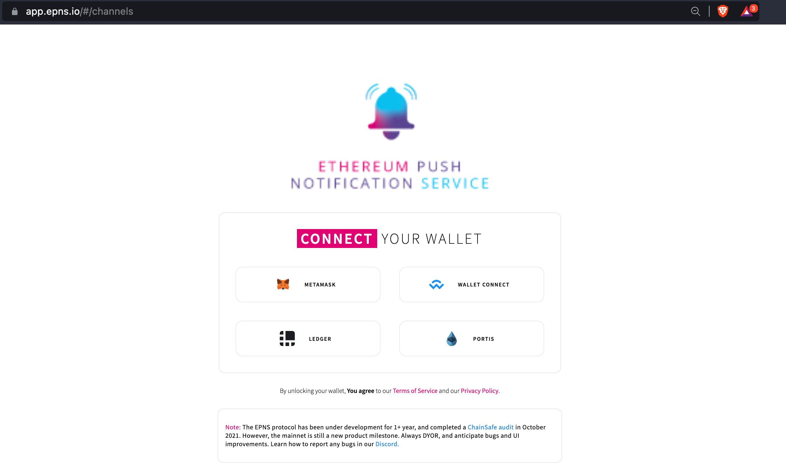

# Creating a Channel using Gnosis Safe

While you can use an EOA for creating a channel, that's not the only option.&#x20;

Channels, on the EPNS protocol, can also be created using a multi-sig contract. Once created, that contract shall be the owner of that channel and any channel action can be performed after the approval of the required signers of that particular multi-sig contract.

In this quick example, we shall learn to create a channel on EPNS using a Gnosis Safe (_instead of a simple EOA_).

### Prerequisites

Before we proceed with the actual steps of connecting the safe to the EPNS dapp and creating a channel, let's quickly understand the prerequisites:

1. Create your own gnosis safe with the right set of owners and policies.
2. Fund your safe with at least 50 DAI. _This amount of DAI is required for channel creation._
3.  Initiate a **contract interaction** from your safe itself to trigger the _**approve()**_** ** function of the [DAI Token](https://etherscan.io/address/0x6B175474E89094C44Da98b954EedeAC495271d0F) with the following values for the argument.

    a. _usr (address) -_ `0x66329Fdd4042928BfCAB60b179e1538D56eeeeeE`

    b. wad (uint256) - 50 DAI

This is important to ensure that the EPNSCore contract is allowed to use 50 DAI from the safe for the successful creation of the channel.

<figure><figcaption>
A sample of how DAI approval transaction
</figcaption></figure>

Alright, once you have ensured all the prerequisites are completed, let's move forward with creating a channel with the Gnosis safe using the following steps.

**Step 1:** Connect to the EPNS Dapp using your Gnosis safe.

a. Go to [https://app.epns.io/](https://app.epns.io/)

b. Select **Wallet Connect** as an option to connect your wallet to the dapp and **Copy the connection link. (**_Keep this link handy as we will use it soon_**)**

c. Open a new tab and go to [https://gnosis-safe.io/](https://gnosis-safe.io/)

d. Once you have connected with your safe on the gnosis safe app, go to the apps section at the left sidebar of the gnosis safe app.

e. Search for the Wallet connect app and click on it.

\
f. Paste the **connection link (**from step b**)** in the given Wallet connect box.

And that's it. Once the connection link is provided your safe is automatically logged in with the EPNS DAPP.

Here is a quick video of the entire process of connecting your safe to EPNS DAPP.


Connecting to EPNS DAPP using your gnosis safe


**Step 2: Create the Channel**&#x20;

Once you have successfully connected your gnosis safe to the EPNS dapp, it basically gets easier from now on.&#x20;

Now creating a channel is an exactly similar process as it was using an EOA account.

Follow the steps mentioned in the following section to create a channel 👇


[deploying-your-first-channel.md](deploying-your-first-channel.md)


**Step 3: Signing and Initiating channel creation transaction.**

The only difference in creating a channel with Gnosis safe is the fact that every transaction must be signed and executed on the gnosis safe app itself.

Therefore, once the channel details are entered and the transaction is initiated, its time for the required number of owners to sign and approve this transaction from the gnosis safe app to execute it.

After the successful execution of the transaction, your channel will be adequately created on the EPNS dapp.&#x20;

_**Remember in order to access the channel's profile page,  you must log in to the dapp from the safe itself.**_
