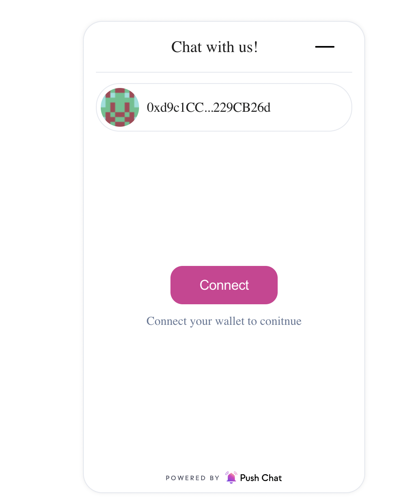
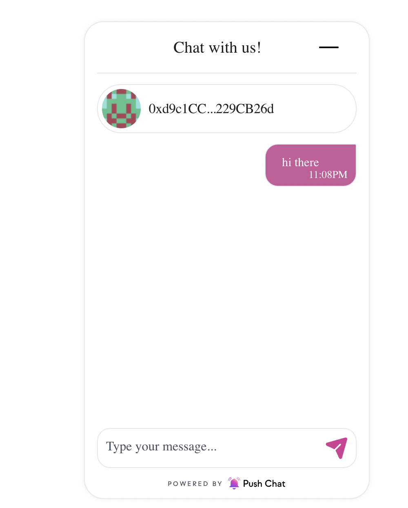
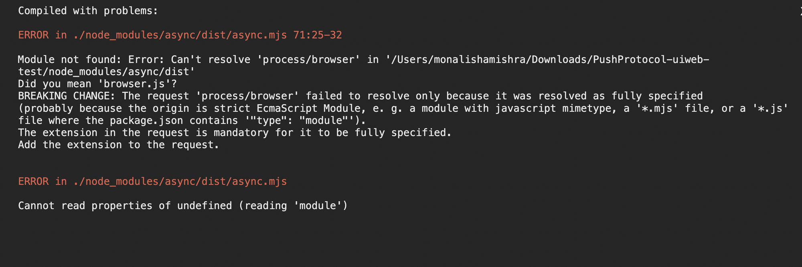

# uiweb@0.2.3-Push Support Chat

### Installation

```
  yarn add @pushprotocol/uiweb@0.2.3 
```

or

```
  npm install @pushprotocol/uiweb@0.2.3
```


_**Note:**_ _`styled-components` and `@pushprotocol/restapi@0.2.1` are `peerDependencies`._&#x20;

__

_Please install them in your dApp if you don't have them already!_


```
  yarn add styled-components
  
  yarn add @pushprotocol/restapi@0.2.1 
```

or

```
  npm install styled-components
  
  npm install @pushprotocol/restapi@0.2.1 
```

### Support Chat component Usage


Import the SDK package in the component file where you want to render notification(s)

```
import { Chat } from "@pushprotocol/uiweb";
```

```typescript
<Chat
   account="0x6430C47973FA053fc8F055e7935EC6C2271D5174" //user address
   supportAddress="0xd9c1CCAcD4B8a745e191b62BA3fcaD87229CB26d" //support address
   apiKey="jVPMCRom1B.iDRMswdehJG7NpHDiECIHwYMMv6k2KzkPJscFIDyW8TtSnk4blYnGa8DIkfuacU0"
    env="staging"
 />
```

<figure><figcaption></figcaption></figure>

<figure><figcaption></figcaption></figure>

<figure><figcaption></figcaption></figure>


| Prop           | Type   | Remarks                                                                                                   |
| -------------- | ------ | --------------------------------------------------------------------------------------------------------- |
| account        | string | User wallet address(the developer has to connect Metamask on their end and pass in the address as params) |
| supportAddress | string | Support wallet adress                                                                                     |
| modalTitle     | string | Title of the chat modal. This field is optional and takes in ‘Chat with us’, if nothing is passed.        |
| primaryColor   | string | Colour of the chat icon. This field is optional and takes in #D53893 is nothing is passed.                |
| apiKey         | string | Api key for using chat feature                                                                            |

### Troubleshoot

During the procedure you might enounter an error as can be seen in the image below.

<figure><figcaption></figcaption></figure>

In case you run into such an error, try to include the below code in config-overrides.js in the root folder.

```typescript
const webpack = require('webpack');

module.exports = function override(config, env) {
  // do stuff with the webpack config...
  config.resolve.fallback = {
    assert: require.resolve('assert'),
    buffer: require.resolve('buffer'),
    child_process: false,
    constants: require.resolve('constants-browserify'),
    crypto: require.resolve('crypto-browserify'),
    fs: false,
    http: require.resolve('stream-http'),
    https: require.resolve('https-browserify'),
    os: require.resolve('os-browserify/browser'),
    path: require.resolve('path-browserify'),
    url: require.resolve('url'),
    util: require.resolve('util/'),
    stream: require.resolve('stream-browserify')
  }
  config.resolve.extensions = [...config.resolve.extensions, '.ts', '.js']
  config.plugins = [
    ...config.plugins,
    new webpack.ProvidePlugin({
      process: 'process/browser',
      Buffer: ['buffer', 'Buffer']
    })
  ]
  config.module.rules = [...config.module.rules,
    {
      test: /\.m?js/,
      resolve: {
        fullySpecified: false
      }
    }
  ]

  return config
}
```
